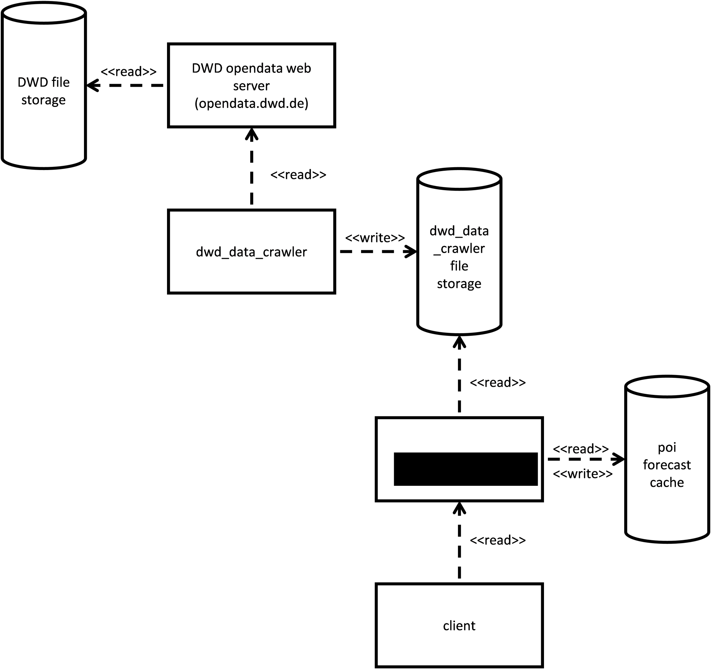

# dwd_forecast_service
`dwd_forecast_service` is a micro service that offers a REST-API to query
weather forecasts based on data that has been downloaded from
[opendata.dwd.de](http://opendata.dwd.de) by micro service `dwd_data_crawler`
([https://github.com/UdSAES/dwd_data_crawler](https://github.com/UdSAES/dwd_data_crawler)).


## License
See the [LICENSE](./LICENSE) file for license rights and limitations (MIT).

## Dependencies
Part of the data on opendata.dwd.de is provided in compressed form. For performance reasons, `dwd_data_crawler` changes the compression from `bzip2` to `lz4` during the download and storage procedure.

In order to provide a forecast, `dwd_forecast_service` needs to decompress the `lz4` files. As of today, we, the authors of `dwd_forecast_service`, are not aware of a high performance implementation of `lz4` in plain JavaScript and/or Node.js. Therefore, we have decided to implement the decompression of `lz4` files by calling `lz4` command via `child_process.execFile`. **Thus, the `lz4` command forms a dependency of `dwd_forecast_service`.**

## Usage
### Standalone application
The micro service is configured via the following environment variables:
* `LISTEN_PORT`: The TCP port the micro service is listening for incoming requests.
* `DATA_ROOT_PATH`: The path to the storage directory where `dwd_data_crawler` is storing the files downloaded from opendata.dwd.de.
* `NEWEST_FORECAST_ROOT_PATH`: The path to the directory where the micro service shall store the newest forecasts for the predefined pois (points of interest).
* `POIS_JSON_FILE_PATH`: The path to the JSON file defining pois (points of interest) for which newest forecasts shall be created. An example of such a file can be found in `./configuration/pois.json`.
* `JWT_PUBLIC_KEY_FILE_PATH`: The path to the public key file to be used to verify JSON web tokens in the authentication header. An example of such a file can be found in `./sample_data/sample_public_key.pem`.

Sample call
```
$ LISTEN_PORT=12345 DATA_ROOT_PATH=/home/service/DWD_data_storage \
  NEWEST_FORECAST_ROOT_PATH=/home/service/forecast_storage \
  POIS_JSON_FILE_PATH=./configuration/pois.json \
  JWT_PUBLIC_KEY_FILE_PATH=./sample_data/sample_public_key.pem \
  node index.js
```

### Docker
To use dwd_forecast_service with docker, the repository includes a Dockerfile to build a docker image based on alpine. To use the docker image the following configuration needs to be done on startup:
* mount source directory of `dwd_data_crawler` (see env `DATA_ROOT_PATH`) to `/mnt/dwd_raw_data`
* mount target directory for newest forecasts of points of interests (see env `NEWEST_FORECAST_ROOT_PATH`) to `/mnt/forecast_cache`
* mount directory of configuration files (i.e. directory where pois.json and vois.json are stored) to `/mnt/configuration`
* mount file with public keys for verifying JSON web tokens (see env`JWT_PUBLIC_KEY_FILE_PATH`) to `/mnt/keys/public_key.pem`

Sample call to build the image
```
$ docker build -t dwd_forecast_service .
```

Sample call to run the image
```
$ docker run -p 12345:12345 -e LISTEN_PORT=12345 \
  -v $DATA_ROOT_PATH:/mnt/dwd_raw_data \
  -v $NEWEST_FORECAST_ROOT_PATH:/mnt/forecast_cache \
  -v $PWD/configuration:/mnt/configuration \
  -v $PWD/sample_data/sample_public_key.pem:/mnt/keys/public_key.pem \
  --name dwd_forecast_service_instance \
  dwd_forecast_service
```

## Basic idea
The basic idea of the micro service `dwd_forecast_service`is to provide weather forecast information based on data previously downloaded by the micro service `dwd_data_crawler` from opendata.dwd.de. Thus, `dwd_forecast_service` itself does not query from opendata.dwd.de directly. This approach has two significant advanteges:
1. Forecast information can be provided even if a connection to opendata.dwd.de is not available (e.g. due to a connection malfunction or if a connection is not possible due to security reasons).
2. As `dwd_data_crawler` is storing data from opendata.dwd.de in a file structure which prevents overriding of data (as it is done by opendata.dwd.de) it is possible to provide historical forecasts which might be interesting for research activities.

The interaction between `opendata.dwd.de`, `dwd_data_crawler` and `dwd_forecast_service` is shown in the following diagram.


Forecasts are provided for predefined points of interest. The predefined points of interest are stored in a configuration file in the path `./configuration/pois.json`.

For each of the predefined points of interest a newest 27 h and 45 h forecast are cyclically derived by the loop as shown in the following diagram.


The forecasts generated by the loop are stored in the files `27h_forecast.json` and `45h_forecast.json` under the path `$NEWEST_FORECAST_ROOT_PATH/$poi_id/` where
* `$NEWEST_FORECAST_ROOT_PATH` given as parameter to the program
* `$poi_id` is the id of the point of interest.
